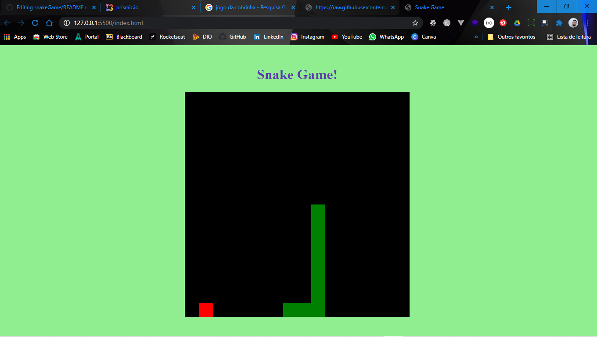

<h1 align="center">Snake Game</h1>

 

---

 

O Snake Game é um jogo que ficou conhecido por diversas versões cuja versão inicial começou com o jogo Blockade de 1976, sendo feitas várias imitações em vídeo-games e computadores. No fim dos anos 90 foi popularizado em celulares da Nokia que vinham com o jogo já incluso :octocat:

  <kbd></kbd>

 

---

 

  <a href="https://www.linkedin.com/in/lucianobalmeida/">
    <kbd></kbd>
  </a>

 

  
    

